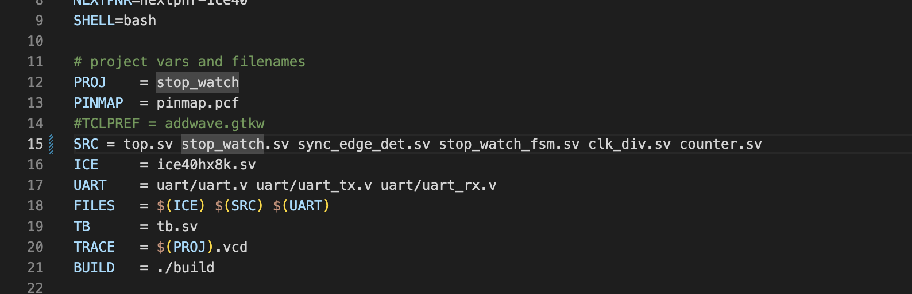
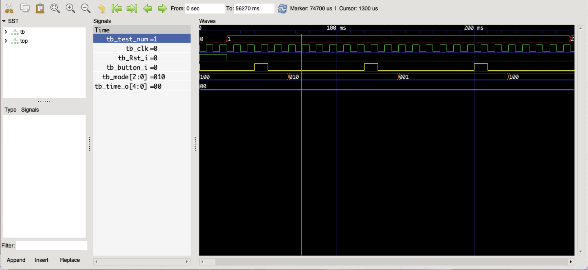
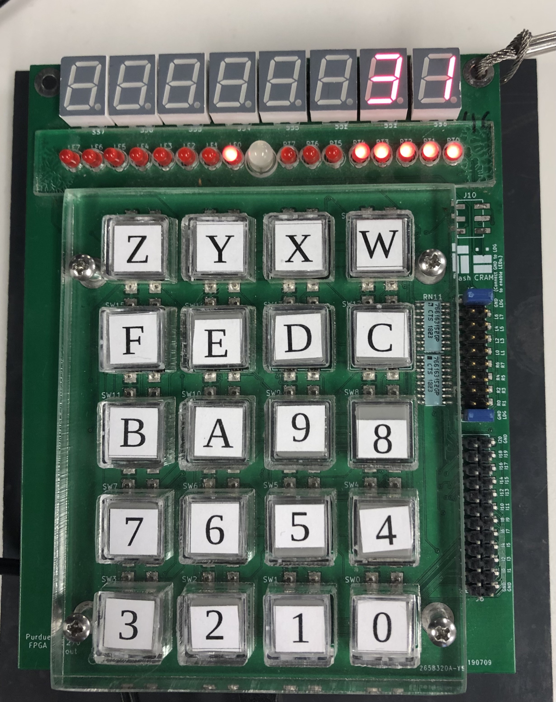

# Stop Watch Module

## __Specifications__
---

* Module name: `stop_watch`

* Module Inputs:
  - `logic clk` 
  - `logic Rst_i`
  -  `logic button_i`

* Module Ouputs:
  - `logic[2:0] mode`
  - `logic[4:0] time_o`

<br>  

The clock provided to your module will be a `100 Hz` clock. 

 The Rst_i signal is an active high asynchronous reset to all the FFs in your design. 

The mode output needs to be 3'b100 when the state of the stop watch is Idle, 3'b010 when the state is Clear, and 3'b001 when the state is Running. 

The time_o output needs to count from 0 (5'b00000) to 31 (5'b11111) and wrap up arround back to 0. 

Button inputs need to be passed through a synchronizer of depth 2, and an edge detector.

## __Behavior__
---

Each button press should change the state of the stop watch from Idle to Clear to Running, and back to Idle again. 


- When the state of the stop watch is Idle the time_o value should not change.

- When the state of the stop watch is Clear the time_o value should be cleared to 0. 

- When the state of the stop watch is running, the time_o value should increment by every second and wrap around to the value 0.


## __Instructions__
--- 
1. Clone this github respository onto your computer
2. Prepare an RTL diagram for your stop_watch module and have it approved by a TA. 
3. Prepare a timing diagram using wavedrom that illustrates the operation of your stop watch module and have it approved by a TA. 
4. Implement your stop_watch module and other supporting modules you need in their own seperate files. Each block in your top level design should be in its own "module-name".sv file where "module-name" is the name of the module contained in the file. Make sure to add those filenames to the "Makefile" file in your directory. On line 15 in the Makefile, you will see a "SRC" variable defined and it only containes "top.sv." Below is an example of what that SRC variable should be set to after you have wrote all supporting files:

<br>

      

<br>

5. To test your module, type the following command in your terminal:
   ```bash
   make verify 
   ```
   This is going to pass your design through a testbench that will test whether your design meets the specifications. In the terminal, you should see the test cases as well as whether you passed them or not.

   To help you debug your design, type the following command to show the waveforms for your design as well as the test inputs:
   ```bash
   make view_waveforms
   ```

   This will open up gtkwave and show the traces for your module's inputs and outputs. Look through those traces to help you debug your design.

   Here is what your window should look like: 

   

<br>

6. After your module is working correctly, and you are not getting any error messages after running 'make verify', you can move on to the next section of implementing the design on the FPGA. 


## __Implementation on the FPGA__
--- 

To implement your design on the FPGA, instantiate it within the top module in top.sv. 

Make the following connections in the top module:
   - connect the clk input to hz100 (this is the 100 Hz clk of the FPGA)
   - connect Rst_i to pb[0].
   - connect button_i to pb[1]. 
   - connect time_o to right[4:0].
   - connect mode to left[2:0]

After you have made all the connections and instantiated your stop watch module, you can flash you design to the FPGA by typing the following command in your terminal: 
   ```bash
      make 
   ```

Demo your design to a TA


## __Optional Tasks__
---

If you have time, try to display the time_o value in decimal to the seven segment displays on the FPGA. 

You will probably need to write a few extra modules. 


The final output should be something like this when the stop watch is running:


